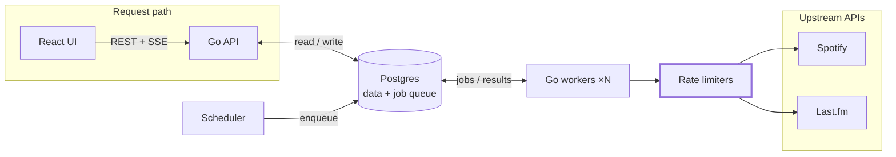

# Bookkeepify — PRD & Design Doc

## Overview

Bookkeepify turns a Spotify Liked Songs pile into a set of coherent playlists then keeps those playlists sorted by routing every new like to the right playlist automatically.

**The problem.** Liking a song is one tap; filing it into the right playlist is a decision. Most people skip the decision, so Liked Songs grows into a list of thousands of tracks that is never reopened. Good songs get lost because there was no obvious playlist to put them in at the moment of liking.

**F1. Organize the backlog.** Analyze all liked songs, group similar ones into clusters, and propose a playlist for each.

- As a user, I log in with Spotify and see a progress view while my liked songs are imported and enriched.
- As a user, I see 5–30 proposed clusters, each with a suggested name (top 2–3 tags, e.g. "dream pop · shoegaze"), track count, and sample tracks.
- As a user, I can rename, merge, split, or drop a cluster, and move individual tracks between clusters.
- As a user, I can choose how granular clustering is (fewer, broader playlists vs. more, narrower ones).
- As a user, I approve clusters and Bookkeepify creates the playlists in my Spotify account, prefixed so I can recognize them (e.g. "bk · dream pop").
- As a user, re-running clustering never duplicates playlists or tracks already placed.

**F2. Keep it organized.** Watch for new likes and add each to the best-matching Bookkeepify playlist.

- As a user, when I like a new song, it shows up in the right Bookkeepify playlist within one sync cycle (~15 minutes), without opening the app.
- As a user, songs that don't fit any playlist well land in an "Inbox" view, where I pick a playlist or start a new one.
- As a user, if I move an auto-sorted song, Bookkeepify treats that as feedback and doesn't fight me by moving it back.
- As a user, I can pause auto-sort or exclude a playlist from receiving auto-sorted songs.

Everything else in this doc exists to make those two features reliable: incremental sync, staying inside Spotify's quota with no babysitting, and recovering cleanly from 429s and crashes. Bookkeepify runs for at most 5 real users but is designed and load-tested for 100,000 (see [Scaling plan](#scaling-plan)).

## Non-goals and success metrics

v1 succeeds if a user with 2,000+ liked songs gets usable playlists in one session and stops filing songs by hand afterward.

**Non-goals for v1**

- Obscurify-style taste profile and stats (phase 2; Spotify removed `popularity` in Feb 2026, so this needs its own data source).
- Comparing taste with friends.
- Recommending songs the user has not liked.
- Playback control, mobile apps, or a public launch.
- Sorting playlists other than Liked Songs.

**Success metrics**

| Metric | Target |
| --- | --- |
| Liked songs placed in an approved playlist after first run | ≥ 80% |
| Auto-routed songs the user moves or removes within 7 days | ≤ 15% |
| Time from a new like to placement | ≤ 1 sync interval (default 15 min) |
| Full first-time ingest + enrichment, 2,000 songs | ≤ 30 min |
| Duplicate playlist adds after crash or retry | 0 |

## Spotify Web API constraints (as of Oct 2026)

Spotify gives us the library and playlist writes, but almost nothing to compute similarity with, and it is slow to read metadata at scale.

| Constraint | Since | Design impact |
| --- | --- | --- |
| Audio features, audio analysis, recommendations, related artists unavailable to new apps | Nov 2024 | No tempo/energy/valence vectors. Similarity needs an external source. |
| `GET /artists` and `GET /tracks` (batch) removed | Feb 2026 | One request per artist. Artist cache is shared across users and is the main cost center. |
| `genres` on artists: not listed as removed, but reported empty by some clients | Feb 2026 | Treat as optional and unverified until the M0 spike. |
| Playlist endpoints moved: `POST /me/playlists`, `/playlists/{id}/items` | Feb 2026 | Verify zmb3/spotify uses the new paths in M0; wrap or patch if not. |
| Playlist contents only readable for playlists the user owns or collaborates on | Feb 2026 | Fine for us: we only manage our own playlists. |
| Quota counted per developer account; 429 carries `"reason": "QUOTA_EXCEEDED"` | Jul 2026 | Quota exhaustion and rate limiting need different handling (see [Failure modes](#failure-modes-and-edge-cases)). |

Still available and used: `GET /me/tracks` (liked songs with `added_at`, 50 per page), `GET /artists/{id}`, playlist reads and writes, plus `GET /me/top/{type}` and `GET /me/player/recently-played` for phase 2. All Spotify calls sit behind one `SpotifyClient` interface, so the API can change again without touching business logic.

## Similarity signal

**Recommendation: build each track's fingerprint from Last.fm crowd tags, behind a pluggable `FeatureProvider` interface, with Spotify metadata as a light secondary signal.**

Tags like "shoegaze", "city pop", "chill" or "90s" map closely to how people actually name playlists. Last.fm's `track.getTopTags` returns tags with counts, and `artist.getTopTags` fills in tracks with few tags. The API needs only an API key, no user login.

| Option | Strength | Weakness | Verdict |
| --- | --- | --- | --- |
| Spotify metadata only (artist, album, release year, `added_at`) | No extra dependency | Can't tell two genres apart; clusters collapse into "same artist" | Secondary signal only |
| Spotify artist `genres` | Free with artist lookup | Possibly empty since Feb 2026; artist-level, not track-level | Use if the spike shows it works |
| **Last.fm tags** | Track-level, weighted, playlist-shaped vocabulary | Noisy tags; ~5 req/s commonly cited; non-commercial terms and 100 MB storage cap (real scale would need a commercial deal or another provider) | **Primary for v1** |
| MusicBrainz genres (via ISRC) | Curated, open data | Sparse coverage; strict ~1 req/s | Fallback provider, phase 2 |
| Audio embeddings from audio | Best "sounds like" signal | No legal audio source via Spotify; heavy compute | Out of scope |

**How a track becomes a vector**

1. Match the Spotify track to Last.fm by artist + title (ISRC is still returned in Spotify's `external_ids`, useful for MusicBrainz later).
2. Fetch top tags; normalize them (lowercase, merge synonyms like "hip hop"/"hip-hop", drop junk like "seen live" or "favorites").
3. If a track has fewer than 3 usable tags, blend in the artist's top tags at reduced weight.
4. Weight tags with TF-IDF over the user's library, so rare tags ("vaporwave") matter more than common ones ("rock").
5. Append small metadata features: release decade, and an artist-identity component so same-artist tracks lean together without dominating.

Tracks are compared by cosine similarity:

$$
\operatorname{sim}(a, b) = \frac{a \cdot b}{\lVert a \rVert \, \lVert b \rVert}
$$

**Provider interface.** A `FeatureProvider` has `Name()`, `Fetch(ctx, TrackRef) (Features, error)` and `RateLimit()`, so each provider owns its own limiter. `TrackRef` carries Spotify ID, ISRC, title and artists; `Features` carries the weighted tag map, source, fetch time and a 0–1 confidence (low when only artist tags were found). This mirrors the SIFT pivot: when one data source disappears, swap the provider, not the system.

## System architecture

A Go API server, a pool of Go workers and a scheduler share one Postgres database; only workers call Spotify and Last.fm for data, always through shared rate limiters.

The API reads only from Postgres and never waits on an upstream (OAuth login is the one exception), so a Spotify outage delays sync but never breaks the UI. Workers are stateless, so adding more never adds upstream load: the limiters cap it.

**Tech stack.** Go with `chi` or `net/http`, zmb3/spotify, `pgx` + `sqlc` for Postgres, React + Vite frontend, Docker Compose for local dev. Start as one binary with `api`, `worker` and `scheduler` subcommands; split into separate deployments only in M6.

## Data model

Postgres holds everything; the split that matters is **shared catalog tables** (one row per track or artist, written once for all users) versus **per-user tables** (likes, clusters, playlists).

| Table | Scope | Purpose |
| --- | --- | --- |
| `users` | per-user | Spotify user ID, encrypted refresh token, settings, sync cursor |
| `tracks` | shared | Spotify track ID, ISRC, title, album, release date, artist IDs |
| `artists` | shared | Spotify artist ID, name, genres (if any), last fetched |
| `track_features` | shared | Tag vector (JSONB, e.g. `{"shoegaze": 0.82}`), confidence, `fetched_at`; key (track, provider) |
| `liked_tracks` | per-user | `added_at`, status (new / placed / inbox / skipped); key (user, track) |
| `clusters` | per-user | Name, centroid vector, granularity run ID, linked playlist |
| `cluster_members` | per-user | (cluster, track, score, source: auto / manual) |
| `playlists` | per-user | Spotify playlist ID, `snapshot_id`, managed flag, detached flag |
| `placement_ops` | per-user | Outbox of playlist writes (add / remove, state); unique on (user, playlist, track, op) |
| `jobs` | system | Postgres-backed job queue and dead letters (see pipeline) |

**Why these choices**

- The composite primary key on `liked_tracks` makes re-syncs naturally idempotent (`INSERT ... ON CONFLICT DO NOTHING`).
- `track_features` keyed by provider lets a second provider coexist and be compared offline.
- `placement_ops` is a transactional outbox: deciding a placement and recording the intent happen in one transaction; a separate worker performs the Spotify write. A crash never loses or duplicates a write.
- Tags start as JSONB for simplicity. If you later want vector search across users, move to pgvector with a fixed tag vocabulary.

## Sync and enrichment pipeline

**Job stages** (each stage enqueues the next; every job is safe to run twice)

1. **SyncLikes(user)** — page `GET /me/tracks` newest first, 50 per page. Stop at the first track whose `added_at` is at or before the user's cursor. Upsert `tracks` and `liked_tracks`, advance the cursor. Enqueue unknown artists and tracks.
2. **EnrichArtist(artist)** — `GET /artists/{id}` once per artist, globally. Skip if fetched within 30 days.
3. **EnrichTrack(track, provider)** — call each `FeatureProvider`. Skip if `track_features` is fresh. Shared across users, so a popular song is fetched once.
4. **Recluster(user)** — runs on demand (F1) or when >20% of a user's library is new since the last run.
5. **Route(user, track)** — for a new like whose features are ready: score against cluster centroids, then write a `placement_ops` row or mark it `inbox`.
6. **ApplyPlacements(user)** — drain the outbox, batch up to 100 URIs per `POST /playlists/{id}/items`, mark rows done.
7. **Reconcile(user)** — daily full scan of liked songs and managed playlists, to catch unlikes, manual moves, and deleted playlists that incremental sync can't see.

**Scheduling.** A scheduler enqueues `SyncLikes` every 15 minutes per active user, with jitter so users don't all fire at once. Inactive users (no login in 30 days) drop to daily.

**Rate limiting.** One token-bucket limiter per upstream (Spotify, Last.fm, MusicBrainz), shared by all workers: `golang.org/x/time/rate` in a single process, a Redis-backed limiter once there are multiple workers. Two priority lanes: **interactive** (new likes, a user waiting on F1) always gets tokens before **backfill** (full-library enrichment). 429 and quota handling is in [Failure modes](#failure-modes-and-edge-cases).

**Queue choice.** Start with a Postgres-backed queue (`SELECT ... FOR UPDATE SKIP LOCKED`), which avoids running extra infrastructure and is a good system design topic on its own. Swap to NATS or Redis Streams only if the simulator shows Postgres becoming the bottleneck.

## Clustering and auto-sort algorithms

Use spherical k-means on the tag vectors for the backlog, and nearest-centroid with a confidence threshold for new likes; both are simple enough to write in Go from scratch, which is part of the learning.

**Backlog clustering (F1)**

1. Build TF-IDF tag vectors for every liked track with features (skip tracks with confidence below 0.2).
2. Pick k from the granularity setting. Default k ≈ √(n/2), clamped to 5–30. For 2,000 songs that is ~30, so "broad" mode halves it.
3. Run spherical k-means (k-means++ seeding, cosine distance, unit-normalized centroids). Run 5 seeds, keep the one with the best average within-cluster similarity.
4. Post-process: merge clusters whose centroids have similarity > 0.85; dissolve clusters with fewer than 8 tracks into the Inbox.
5. Name each cluster by its most *distinctive* tags: centroid weight minus the library-wide average weight, top 2–3.
6. Tracks with `source = manual` membership are pinned and never moved by a rerun.

**Auto-sort (F2)**

1. Score the new track against every managed cluster centroid.
2. Place it if the best score ≥ θ (start 0.35) **and** beats the runner-up by ≥ δ (start 0.05). Otherwise, Inbox.
3. Update that centroid incrementally (running mean) so clusters drift with the user's taste.
4. If the user moves a track, record it as manual, update both centroids, and log the event as a labeled example.

**Tuning θ and δ offline.** After the user approves clusters, hold out 10% of each cluster's tracks, route them, and measure accuracy versus Inbox rate. Pick thresholds that meet the correction target in Success metrics. Manual moves become a growing test set.

**Alternatives worth noting.** HDBSCAN finds noise points naturally (a natural Inbox) but is harder to implement and tune. Agglomerative clustering gives a tree, so the granularity slider could cut it without re-running, but it needs O(n²) memory, which is too much at 20,000 songs.

## API design

A small REST API serves the React frontend; long operations return a `job_id` immediately and the client polls (or subscribes via SSE) for progress.

| Resource | Endpoints | Purpose |
| --- | --- | --- |
| Auth | `GET /auth/login`, `GET /auth/callback` | Spotify OAuth (Authorization Code + PKCE); store encrypted refresh token, set session cookie |
| Sync and jobs | `POST /api/sync`, `GET /api/jobs/{id}`, `GET /api/jobs/{id}/events`, `GET /api/library/stats` | Trigger a sync; job progress (e.g. 1,240 / 2,000 enriched) by poll or SSE; counts of liked, enriched, placed, inbox |
| Clusterings | `POST /api/clusterings`, `GET /api/clusterings/{id}`, `POST /api/clusterings/{id}/apply` | Run with `{granularity}`; proposed clusters with names, sizes, samples; create/update Spotify playlists for approved clusters |
| Clusters | `PATCH /api/clusters/{id}`, `POST /api/clusters/{id}/merge`, `POST /api/clusters/{id}/tracks` | Rename or toggle `auto_sort`; merge another cluster in; move tracks in manually |
| Inbox | `GET /api/inbox`, `POST /api/inbox/{track_id}/place` | Tracks awaiting a decision with top-3 suggestions; place into a cluster or a new one |
| Settings | `PATCH /api/settings` | Pause auto-sort, unlike behavior, playlist prefix |

**Conventions**

- Mutating endpoints accept an `Idempotency-Key` header so retries from the client are safe.
- Cursor pagination on any list (`?cursor=...&limit=50`).
- Errors as `{"error": {"code": "...", "message": "..."}}`, mirroring Spotify's shape.
- Refresh tokens never leave the server; the browser only holds an HTTP-only session cookie.

## Scaling plan

Bookkeepify runs for real for Edrick plus up to 4 allowlisted friends: Spotify Development Mode (since Feb 2026) caps an app at 5 authenticated users and the owner needs Premium, so correctness matters more than throughput. Every component is still designed for 100,000 users and exercised with the M6 simulator.

At that size the bottleneck is not compute or storage but third-party enrichment: tagging 30M unique tracks at ~5 req/s would take about 69 days. So track and artist metadata is shared across users and fetched once, while per-user data stays isolated.

| Assumption (simulated) | Value |
| --- | --- |
| Users | 100,000 registered, 10% active daily |
| Liked songs per user | median 1,500, p99 20,000 |
| Unique tracks / artists across users | ~30M / ~2M (heavy overlap between users) |
| New likes per active user per day | ~5 |
| Sync interval | 15 min per active user |

| Load | Math | Result |
| --- | --- | --- |
| Incremental Spotify syncs | 10,000 active × 96 syncs/day | ~960k calls/day, ~11/s |
| New likes | 10,000 × 5/day | 50k/day |
| New unique tracks needing tags | ~20% of new likes (rest already cached) | ~10k/day, well under 1/s |
| Cold-start track tagging | 30M tracks ÷ 5 req/s | ~6M s ≈ 69 days |
| Cold-start artist tagging | 2M artists ÷ 5 req/s | ~4.6 days |
| Postgres size | 30M tracks × ~1 KB features + 150M likes × ~50 B | ~40 GB, one node is fine |

**Design responses**

- **Progressive enrichment.** Tag artists first (fast, coarse), cluster on artist tags, then refine with track tags in the background. The user gets usable playlists in minutes, better ones later.
- **Popularity-ordered backfill.** Enrich tracks liked by the most users first; one fetch serves many users.
- **Shared catalog cache** with long TTLs (30–90 days): tags change slowly.
- **Incremental sync** with cursors, not full rescans; full reconcile only daily.
- **Horizontal workers** behind Redis-backed limiters (see [System architecture](#system-architecture)).

## Failure modes and edge cases

| Situation | Detection | Response |
| --- | --- | --- |
| Spotify rate limit | 429 + `Retry-After` | Pause that upstream's limiter for `Retry-After`, requeue the job |
| Spotify quota exhausted | 429 with `reason: QUOTA_EXCEEDED` | Circuit breaker on the whole Spotify lane (start at 1 hour, exponential), "sync delayed" banner |
| Job keeps failing | Attempt count exceeds N | Move to dead-letter table for inspection |
| Worker crash mid-write | Job lease expires | Another worker retries; outbox unique key prevents duplicates |
| Refresh token revoked or expired | 400/401 on refresh | Mark user `needs_reauth`, stop their jobs, email or banner |
| Last.fm doesn't know a track | Empty tags | Fall back to artist tags at lower confidence; none → Inbox |
| User unlikes a song | Daily reconcile | Leave it in the playlist by default (user owns their playlists); removal is a setting |
| User deletes or renames a Bookkeepify playlist | Next sync | Mark the cluster detached |
| User edits a playlist in Spotify | `snapshot_id` changed | Re-read playlist, treat removals as manual feedback |
| Same song liked under two Spotify IDs (relinked/remastered) | Same ISRC | Dedupe by ISRC |
| Local files or podcast episodes in Liked Songs | Item type | Skip |
| Spotify API changes again | Contract tests against recorded responses fail in CI | Fix behind `SpotifyClient` interface |

**Observability.** Prometheus metrics for queue depth per lane, upstream calls and 429s per provider, enrichment coverage, route-vs-inbox rate, and job latency. Structured logs with `user_id` and `job_id` on every line.

## Milestones

Build in seven phases, each ending in something that runs end to end; phase 0 is a one-day spike that can change the plan.

1. **M0 — API spike.** Confirm zmb3/spotify works against the post-Feb-2026 endpoints (create playlist, add items). Check whether `genres` comes back on `GET /artists/{id}`. Fetch Last.fm tags for 50 of your liked songs and eyeball quality. *Exit: a written go/no-go per data source.*
2. **M1 — Ingest.** OAuth, `users` and `liked_tracks` tables, `SyncLikes` with cursor, Postgres job queue, Spotify rate limiter. *Exit: your full library in Postgres; re-running sync changes nothing.*
3. **M2 — Enrich.** `FeatureProvider` interface, Last.fm provider, artist and track enrichment jobs, priority lanes, 429 and quota handling. *Exit: ≥ 90% of your liked songs have features.*
4. **M3 — Cluster.** Spherical k-means, naming, a CLI that prints clusters. Iterate on tag normalization until the clusters feel right. *Exit: you would accept most clusters as playlists.*
5. **M4 — Apply + UI.** React review screen, rename/merge/move, outbox and `ApplyPlacements`. *Exit: real playlists created in your Spotify account, no duplicates on retry.*
6. **M5 — Auto-sort.** Scheduler, `Route`, Inbox, manual-move feedback, daily reconcile. *Exit: a week of new likes sorted within the correction target.*
7. **M6 — Scale lab.** Fake Spotify server (same HTTP shapes, configurable latency and 429 rate), synthetic-user load generator with realistic overlapping libraries, Redis limiter, multiple workers, Prometheus dashboards. *Exit: simulate 10,000 users and find the first bottleneck.*

**Phase 2 candidates:** Obscurify-style taste profile (top tags over time from `GET /me/top`, a "niche-ness" score from Last.fm listener counts in place of Spotify popularity), compare with friends, MusicBrainz provider.

## Open questions

Questions M0 answers (artist `genres`, zmb3/spotify paths) are tracked there.

- [ ] What is Spotify's actual Dev Mode quota? It isn't published; measure it in M1 and record it.
- [ ] Do Spotify refresh tokens now expire on a fixed schedule? Some trackers report a six-month expiry; confirm and design re-auth around it.
- [ ] Should Bookkeepify ever manage playlists the user created by hand, or only its own?
- [ ] Frontend: plain React + Vite, or reuse anything from SIFT?
- [ ] Hosting: one small VM with Postgres + Redis, or a managed setup (Fly.io, Railway)?

## Sources

- [Spotify Web API Changelog — February 2026](https://developer.spotify.com/documentation/web-api/references/changes/february-2026)
- [Spotify Web API Changelog — March 2026](https://developer.spotify.com/documentation/web-api/references/changes/march-2026)
- [Spotify: Web API quota updates for Development Mode (Jul 23, 2026)](https://developer.spotify.com/blog/2026-07-23-web-api-quota-updates)
- [Spotify February 2026 migration guide](https://developer.spotify.com/documentation/web-api/tutorials/february-2026-migration-guide)
- [TechCrunch: Spotify changes developer mode API (Feb 6, 2026)](https://techcrunch.com/2026/02/06/spotify-changes-developer-mode-api-to-require-premium-accounts-limits-test-users/)
- [Last.fm API: track.getTopTags](https://www.last.fm/api/show/track.getTopTags)
- [zmb3/spotify on GitHub](https://github.com/zmb3/spotify)
